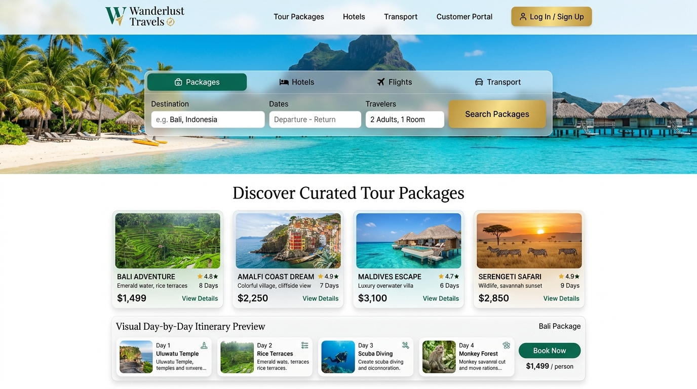

# 🌍 Wanderlust Travels — Luxury Travel Agency & Booking Platform (UI-Only)

An end-to-end, high-end travel agency booking web platform crafted with **React, Vite, and Tailwind CSS**. Designed for discerning travelers, the platform features curated tour packages, 5-star hotel selection, private transport charters, interactive custom day-by-day itineraries, multi-gateway payment checkout, an active client portal, and verified digital travel documents.

---

## 📸 Website UI Previews

*Emerald Green & Warm Gold luxury aesthetics, floating multi-tab booking search bar, curated package cards, and a visual day-by-day itinerary teaser.*



---


## ✨ Key Features & Modules

### 1. 💱 Multi-Currency Engine (Including BDT ৳)
* Seamlessly switch between **BDT (৳)**, **USD ($)**, **EUR (€)**, **GBP (£)**, and **AUD (A$)**.
* All package rates, villa upgrades, private transfer fares, checkout calculations, and printable vouchers adjust automatically in real-time.

### 2. 🌴 Curated Tour Packages
* Handcrafted expeditions to iconic destinations:
  * **Bali Island Sanctuary & Cultural Splendor**
  * **Amalfi Coast Cliffside Dream & Capri Yachting**
  * **Maldives All-Inclusive Overwater Villa Sanctuary**
  * **Serengeti Great Migration & Ngorongoro Crater Safari**
  * **Swiss Alps Glacier Express & Alpine Luxury Chalets**
  * **Japan Heritage: Kyoto Zen Temples & Tokyo Future**
* Filter by geographic region and sort by rating, price, or trip duration.

### 3. 🗺️ Interactive Day-by-Day Itinerary Viewer
* Detailed modal showcasing daily schedules, included gourmet meals, 5-star accommodations, and daily excursion highlights.
* Transparent inclusions and exclusions lists with high-resolution photo galleries.

### 4. 🏨 Luxury Hotels & Villas Hub
* Browse vetted 5-star boutique resorts and overwater compounds.
* Interactive suite tier selector (Standard Ocean Suite, Private Pool Cliff Villa, Overwater Lagoon Slide Villa) with live pricing.

### 5. 🚗 Private Transport & VIP Transfers Hub
* Executive Mercedes-Benz Vans, S-Class Chauffeurs, High-Speed Island Speedboats, and Scenic Direct Helicopters with luggage and passenger capacity guides.

### 6. ✍️ Tailor-Made Custom Itinerary Planner
* Build your own vacation from scratch: select destination, expedition length (3, 5, 7, 10 days), and add or remove VIP excursions (Temple visits, catamaran charters, volcanic sunrise 4x4 tours, cooking classes) with live cost calculation.

### 7. 💳 Multi-Step Checkout & Simulated Payment
* **Guest details**: lead passenger info, passport numbers, travel dates, and special requests.
* **Upgrades**: TravelGuard World Elite Insurance, VIP Airport Fast-Track, and dedicated vacation photographer.
* **Multi-Gateway Payment**: Credit/Debit Cards, Stripe Checkout, Apple Pay, PayPal, and **bKash Mobile Payment**.
* Generates persistent booking references (`WL-XXXXX`) stored in `localStorage`.

### 8. 👤 VIP Customer Portal
* **Live Countdown Timer**: Days, Hours, Minutes, and Seconds until departure.
* **Live Flight Status Tracker**: Airline flight numbers, terminal, departure gate, seat assignment, and real-time status.
* **Assigned Dedicated Concierge**: Direct messaging and call support with personal travel specialist (Chloe Davis).
* **Payment Invoices**: Full itemized receipts and transaction history.

### 9. 📄 Digital Travel Documents Vault
* Official printable and downloadable vouchers formatted for desktop and paper print (`window.print()`):
  * **e-Ticket / Airline Boarding Pass** with scannable QR code.
  * **Prepaid Luxury Hotel Check-In Voucher**.
  * **VIP Chauffeur & Ground Transfer Pass**.
  * **TravelGuard Insurance Certificate** (\$250,000 policy guarantee).

---

## 🛠️ Technology Stack

* **Frontend**: React 19, JavaScript (ES Modules)
* **Build Tool**: Vite 8
* **Styling**: Tailwind CSS 3.4 with custom emerald and gold luxury color palette
* **Icons**: Lucide React
* **Typography**: Playfair Display (Serif headings) & Plus Jakarta Sans (UI body)
* **Persistence**: Browser `localStorage`

---

## 🚀 Getting Started

### Prerequisites
* [Node.js](https://nodejs.org/) (v18 or higher recommended)
* npm (bundled with Node.js)

### Installation & Run

1. **Clone or navigate to the project directory:**
   ```bash
   cd Travel
   ```

2. **Install dependencies:**
   ```bash
   npm install
   ```

3. **Start the local development server:**
   ```bash
   npm run dev
   ```

4. **Open your browser and visit:**
   ```
   http://localhost:5173/
   ```

5. **Build for production:**
   ```bash
   npm run build
   ```

---

## 📂 Project Structure

```
Travel/
├── index.html                   # HTML entry with Google fonts
├── package.json                 # Dependencies & scripts
├── tailwind.config.js           # Custom luxury theme & colors
├── screenshots/                 # UI Mockup images for documentation
│   ├── travel_ui_luxury.jpg     # Discovery & booking bar UI
│   ├── travel_ui_booking.jpg    # Custom itinerary & checkout UI
│   └── travel_ui_portal.jpg     # Customer portal & documents UI
├── src/
│   ├── main.jsx                 # React root
│   ├── App.jsx                  # Master app container with navigation & state
│   ├── index.css                # Tailwind directives & print styles
│   ├── data/
│   │   ├── packagesData.js      # Curated tour packages & day itineraries
│   │   ├── hotelsData.js        # Luxury hotels, villas & suites
│   │   ├── transportData.js     # Chauffeurs, speedboats & helicopters
│   │   └── mockBookings.js      # Initialized active booking
│   ├── utils/
│   │   └── formatters.js        # Multi-currency (BDT, USD, EUR, etc.) & dates
│   └── components/
│       ├── Navbar.jsx           # Top bar with BDT currency selector
│       ├── HeroSearch.jsx       # Floating multi-tab search engine
│       ├── ItineraryPreviewBanner.jsx # Option 1 Day-by-day teaser
│       ├── PackageCard.jsx      # Curated tour package card
│       ├── PackageDetailModal.jsx # Itinerary viewer & inclusions
│       ├── HotelsSection.jsx    # Luxury stays & room selector
│       ├── TransportSection.jsx # Private transfers & airport rides
│       ├── CustomItineraryBuilder.jsx # Day-by-day trip planner
│       ├── BookingModal.jsx     # Checkout & multi-gateway payment
│       ├── CustomerPortal.jsx   # VIP client dashboard & countdown
│       ├── TravelDocuments.jsx  # Printable e-Tickets & vouchers
│       ├── AgentChatModal.jsx   # Concierge chat assistant
│       └── Footer.jsx           # Luxury footer with newsletter
└── README.md                    # Project documentation
```

---

## 📜 License
Licensed under the [MIT License](LICENSE).
